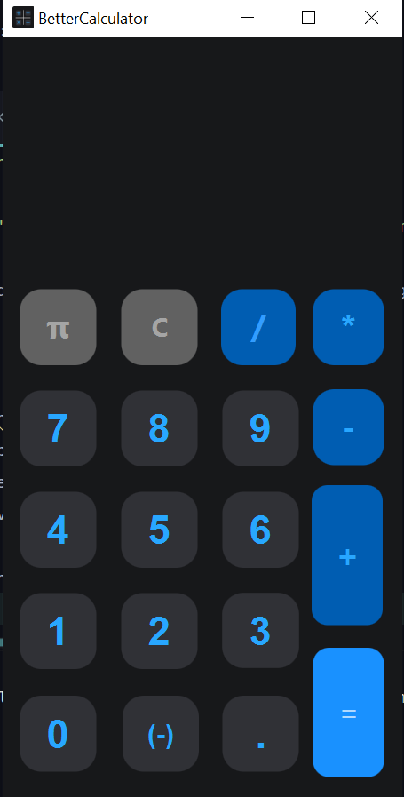
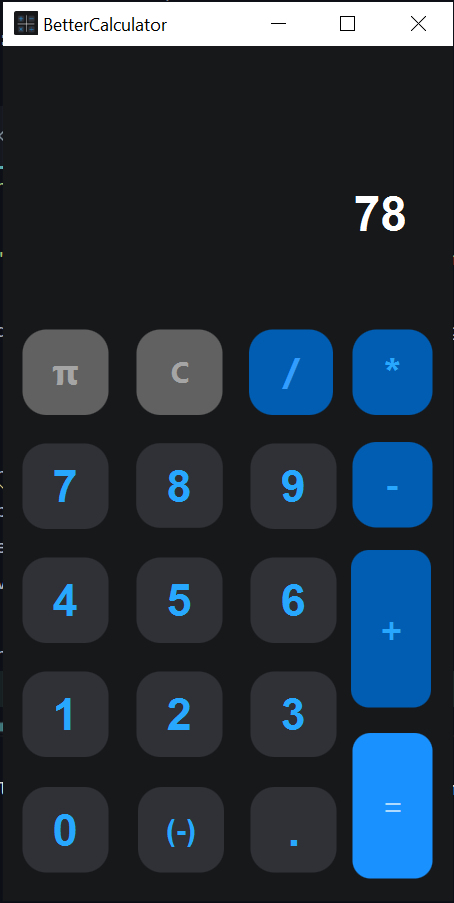
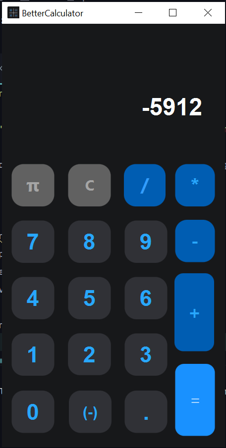
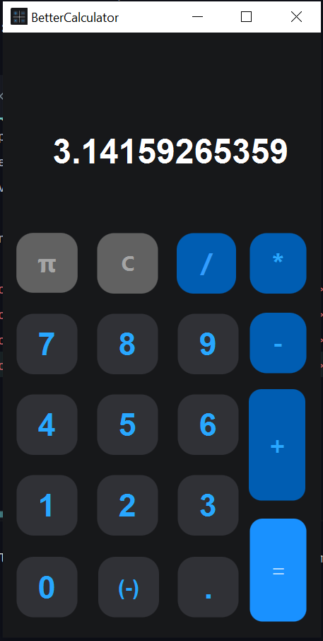

# BetterCalculator

#### It's a calculator made in java with the framework JavaFX.

Download is not available because I haven't managed to compile it and will think about it if I have time, but the application works very well.

You can :
- add
- substract
- multiply
- divide
- resolve operations

Some screenshots :
- ### When I start the calculator
</img>
- ### Positive number
</img>
- ### Negative number
</img>
- ### When I push pi number :
</img>
